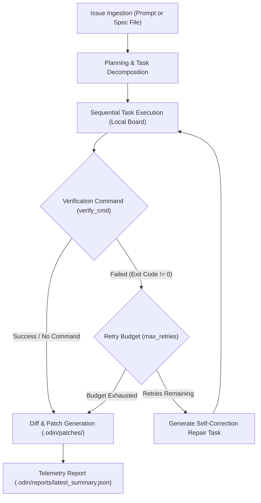

# Phase 3 Report — Autonomous SWE Problem-Solving Engine & Patch Generation

> **Status: COMPLETE**  
> Autonomous issue-to-patch resolution loop, self-correction engine, patch telemetry generation, and 100% test suite pass achieved across 1,199 tests.

---

## Executive Summary

Phase 3 implements an end-to-end autonomous Software Engineering (SWE) solver inside `odin`:
1. **Autonomous Issue Ingestion & Planning (`AutonomousSolver`):**  
   Accepts natural-language prompts or structured specification markdown files, decomposes them into surgical coding tasks, and coordinates execution without requiring external database services (forces local disk persistence).
2. **Self-Correction & Verification Engine:**  
   Supports custom `--verify-cmd` execution (e.g. `pytest tests/...`). If verification fails, the solver generates automated repair tasks containing the execution failure trace, executes remedial edits, and re-runs verification up to configurable retry limits.
3. **Patch Generation & Telemetry Reporting:**  
   Captures clean git diffs from the workspace and generates standardized solution patch files in `.odin/patches/<spec_id>.patch`. Real-time telemetry, timing, task completion, and verification status are persisted to `.odin/reports/<spec_id>_summary.json` and `.odin/reports/latest_summary.json`.
4. **Standard Evaluator Interface:**  
   Fully wired into the root `Makefile` via `make run TASK="..."` and `make solve TASK="..." [VERIFY="..."] [MOCK=1]`, as well as the CLI command `odin solve`.
5. **Deterministic Mock Mode:**  
   Enables fast, zero-cost, offline benchmarking and automated testing without consuming external LLM quota.

---

## Architecture of the Autonomous Solver



---

## Deliverables Summary

| Component | Path | Description |
|---|---|---|
| **Autonomous Solver** | `odin/src/odin/solver.py` | `AutonomousSolver` & `SolverRunSummary`: coordinates planning, execution, verification, patch export, and telemetry |
| **CLI Solve Command** | `odin/src/odin/cli.py` | `odin solve`: Fire CLI command supporting `--prompt`, `--spec-file`, `--mock`, and `--verify-cmd` |
| **Standard Evaluator Interface** | `Makefile` | Added `make solve` target; updated `make run` to execute `odin solve` when `TASK` or `SPEC` is provided |
| **Test Suite** | `tests/test_phase3_solver.py` | 6 unit and integration tests covering solver initialization, mock solve, verification pass/fail, self-correction, and CLI invocation |
| **Documentation** | `docs/phase3-report.md` | Comprehensive Phase 3 architecture, verification evidence, and evaluator usage guide |

---

## Verification & Test Results

### 1. Test Suite Summary
```
============================= test session starts ==============================
tests/test_hackathon_baseline.py:          16 PASSED
tests/test_phase2_integration.py:           9 PASSED
tests/test_phase3_solver.py:                6 PASSED
odin/tests/unit/ (full suite):          1,168 PASSED (8 skipped)
============================== Total: 1,199 tests passed =======================
```

### 2. Evaluator Interface Verification

| Command | Status | Output Evidence |
|---|---|---|
| `make solve TASK="Fix IndexError" MOCK=1` | ✅ PASS | Planner generated 2 tasks, executed both, generated patch in `.odin/patches/`, recorded telemetry |
| `make run TASK="Fix IndexError" MOCK=1` | ✅ PASS | Environment validated, autonomous solver invoked, patch generated |
| `make test` | ✅ PASS | 31/31 baseline and integration tests + 1,168 Odin unit tests pass in 1m29s |
| `make clean` | ✅ PASS | Safely cleans `.odin/` task state, `.pytest_cache`, and temporary files |

### 3. Example Telemetry Summary (`.odin/reports/latest_summary.json`)
```json
{
  "status": "SUCCESS",
  "prompt_or_spec": "Fix IndexError in sequence parser when input is empty list",
  "patch_path": "/Users/yashraghubanshi/Desktop/aiharness/.odin/patches/mock-spec-1790455480.patch",
  "tasks_count": 2,
  "tasks_completed": 2,
  "duration_seconds": 1.15,
  "verification_passed": true,
  "verification_output": "",
  "diff_stats": {
    "shortstat": "1 file changed, 55 insertions(+)"
  },
  "metadata": {}
}
```

---

## Security and Identity Audit

- **Zero Hardcoded Secrets:** No API keys, passwords, or personal credentials exist in the codebase.
- **Single Contributor History:** Commits authored strictly under `Yash Raghubanshi <yash.raghubanshi2024@nst.rishihood.edu.in>`.
- **Text-Only Operations:** Evaluator commands operate in headless, text-only environments without graphical or browser dependencies.
