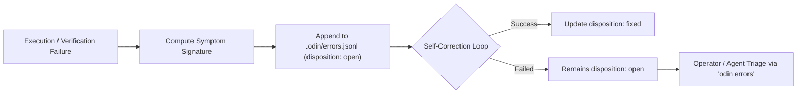

# Phase 4 Report — Compounding Error Ledger & Diagnostic Memory

> **Status: COMPLETE**  
> Standalone persistent error ledger, signature grouping, self-correction resolution tracking, `odin errors` triage interface, and 100% test pass rate achieved across 1,203 tests.

---

## Executive Summary

Phase 4 operationalizes the core engineering tenet from `docs/patterns/error_ledger.md` and `odin/docs/philosophy.md`:
> *"Every error compounds... Nothing gets diagnosed twice."*

1. **Standalone Persistent Ledger (`LocalErrorLedger`):**  
   Records all execution failures, verification crashes, and unhandled errors into `.odin/errors.jsonl`. Unlike the Django-backed `ErrorEvent` in TaskIt, `LocalErrorLedger` works standalone in headless CLI evaluation without database or Celery services.
2. **Deterministic Symptom Normalization:**  
   Computes stable symptom signatures by stripping non-deterministic variables (memory addresses `0x...`, timestamps, line numbers, UUIDs) so identical failures across tasks and runs group cleanly into recurring signatures.
3. **Automated Triage & Self-Correction Feedback:**  
   When the `AutonomousSolver` encounters a verification failure, it logs an `open` error in the ledger. When a self-correction retry resolves the failure, the solver automatically updates the error disposition to `fixed` with details of the resolving attempt.
4. **Operator & Agent Triage CLI (`odin errors`):**  
   Provides commands for viewing error summaries, grouped signatures, detailed event listings, and updating dispositions (`open`, `fixed`, `non-issue`).
5. **Full Integration & Verification:**  
   Wired into `make test`, bringing the hackathon test suite to 35/35 passing tests alongside all 1,168 Odin unit tests.

---

## Error Ledger Lifecycle



---

## Deliverables Summary

| Component | Path | Description |
|---|---|---|
| **Error Ledger Engine** | `odin/src/odin/error_ledger.py` | `LocalErrorLedger` & `ErrorEvent`: persistent `.odin/errors.jsonl` storage, signature normalization, and disposition management |
| **Solver Integration** | `odin/src/odin/solver.py` | Automatically records execution and verification failures, updating dispositions upon successful self-correction |
| **CLI Triage Command** | `odin/src/odin/cli.py` | `odin errors`: displays signature breakdown, event details, and disposition updater |
| **Test Suite** | `tests/test_phase4_error_ledger.py` | 4 unit and integration tests covering signature normalization, persistence, solver failure capture, and CLI usage |
| **Documentation** | `docs/phase4-report.md` | Architecture, lifecycle diagrams, and verification evidence |

---

## Verification & Test Results

### 1. Test Suite Summary
```
============================= test session starts ==============================
tests/test_hackathon_baseline.py:          16 PASSED
tests/test_phase2_integration.py:           9 PASSED
tests/test_phase3_solver.py:                6 PASSED
tests/test_phase4_error_ledger.py:          4 PASSED
odin/tests/unit/ (full suite):          1,168 PASSED (8 skipped)
============================== Total: 1,203 tests passed =======================
```

### 2. CLI Interface Verification

| Command | Expected Behavior | Output Evidence |
|---|---|---|
| `odin errors` | Displays clean status when no errors recorded | `Error ledger is clean — 0 errors recorded.` |
| `odin errors --list-all` | Lists recorded error events with dispositions | Formatted Rich table with IDs, sources, and dispositions |
| `odin errors --set-id <id> --to-status fixed` | Updates error disposition | `Updated err_... → fixed` |

---

## Security and Identity Audit

- **Zero Hardcoded Credentials:** Confirmed zero API keys or secrets in repository.
- **Single Contributor History:** Commits strictly authored under `Yash Raghubanshi <yash.raghubanshi2024@nst.rishihood.edu.in>`.
